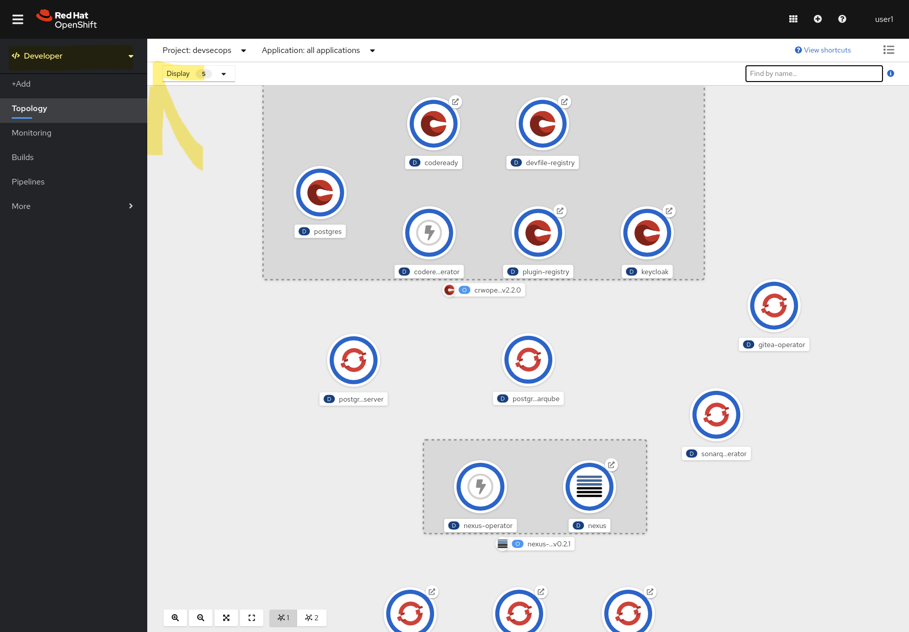

This lab provides a quick tour of the console to help you get familiar with the user interface along with some key terminology we will use in subsequent lab content.

## Key Terms

We will be using the following terms throughout the workshop labs so here are some basic definitions you should be familiar with. You'll learn more terms along the way, but these are the basics to get you started.

* **Container** - Your software wrapped in a complete filesystem containing everything it needs to run
* **Image** - We are talking about docker images; read-only and used to create containers
* **Pod** - One or more docker containers that run together
* **Service** - Provides a common DNS name to access a pod (or replicated set of pods)
* **Project** - A project is a group of services that are related logically
* **Deployment** - an update to your application triggered by a image change or config change
* **Build** - The process of turning your source code into a runnable image
* **BuildConfig** - configuration data that determines how to manage your build
* **Route** - a labeled and DNS mapped network path to a service from outside OpenShift
* **Master** - The foreman of the OpenShift architecture; the master schedules operations, watches for problems, and orchestrates everything
* **Node** - Where the compute happens; your software is run on nodes
* **Pipeline** - Automates the control, building, deploying, and promoting your applications on OpenShift

## Dashboard Tour

This workshop is provisioned with a special dashboard that gives you easy access to a web terminal with the  `oc` command line tool pre-installed, the OpenShift web console, and Red Hat's in-browser IDE: CodeReady Workspaces. Let's get started by logging into each of these and checking the status of the platform.

### View projects with `oc`

In the Terminal tab, check to see what projects you have access to:

```execute
oc get projects

```

### Now check in the Web Console

Open the Console tab in your dashboard. You may start off in the Developer view. If you change that to Administrator using the pulldown in the top left you should see your available projects. If none had existed already, you would see a button to create one.



### Access your personal developer workspace

As part of this workshop, you'll have your own developer workspace, equipped with developer tooling and plugins, all running in a container. Open the CodeReady Workspaces tab to view the workspace we've created for you. We'll explore this in more detail later on.

### Summary

You should now be ready to get hands-on with our workshop labs.
