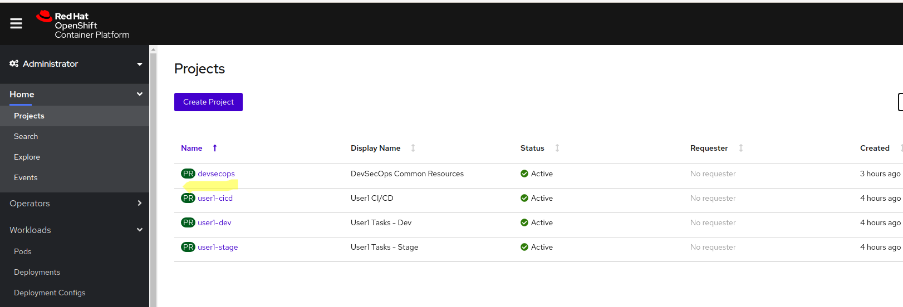
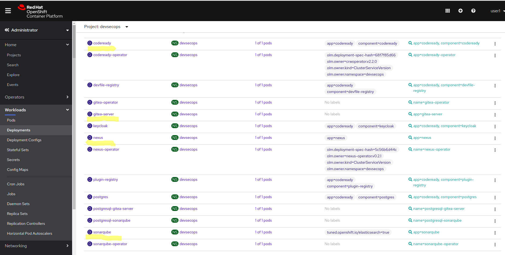
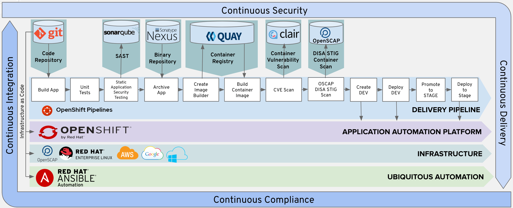

Before moving forward, it is important to understand the difference between [Continuous Integration (CI), Continuous Delivery (CD), and Continuous Deployment][1].

Also, a part of this lab we’ll be using [OpenShift Pipelines][2] for CI/CD, which gives you control over building, deploying, and promoting your applications on OpenShift. OpenShift Pipelines is directly integrated in OpenShift and allows users to build extensible pipelines using familiar cloud native constructs (such as containers) based on the Tekton upstream project. We will dive into further details on Tekton in a follow-on lab.

OK, let’s start by exploring the components of an OpenShift CI/CD Pipeline using the OpenShift Console.

First, ensure that the pulldown in the very top left of the embedded OpenShift Web Console indicates "Administrator" and not "Developer", then click on the `devsecops` project from the list of projects.

You will see the project dashboard which shows the "common infrastructure" for our Secure Software delivery pipeline. If you navigate to the "Deployments" section underneath "Workloads" on the left-hand nav bar, you will see deployments for each of the following software components:

- codeready - CodeReady Workspaces is a browser-based development environment based on Eclipse Che
- gitea-server - Gitea is an open source git server written in Go.
- nexus - Nexus is a popular artifact repository manager used for storing and retrieving binary artifacts such as jars, npms, etc.
- sonarqube - SonarQube is an open source static code analysis tool
- some additional supporting deployments such as databases

There are some other components for our pipeline that live inside other projects, for a number of reasons, but these are some exemplar components to make up our Secure Software Factory.

# The Flow of the Secure Software Factory

You may ask, "How am I going to build a CI/CD pipeline if I don't have a tool like Jenkins that builds CI/CD pipelines?" OpenShift Pipelines is the CI/CD tool (based on the upstream Tekton project) that will execute the project. We'll be using cloud-native container-based tooling and the power of the Kubernetes container orchestrator to execute our steps.

Below are the main steps of the "Deploy to Dev" pipeline:

- Clone the git repository and make it available to the rest of the pipeline tasks
- Compile and packages the code using Maven
- Execute the JUnit tests that exist in the same source tree
- Analyze the source code for vulnerabilities, bugs, and bad patterns using SonarQube
- Package the application as a WAR file, then push the WAR artifact to the Nexus Repository manager
- Create a container image based the JBoss EAP runtime image and the content of the WAR artifact, tagging it with the hash of the git revision
- Deploy the newly created container image into the %username%-dev project

At this point, the first part of the pipeline only deploys the application to the Dev environment so that it can be tested/verified there. The verification of the deployed application can involve many different aspects : manual verification, execution of some integration tests against the running system, etc. We have intentionally not automated any tests here to simulate a manual quality check and enable you to explore this part of the pipeline.

When the verification is complete, the "Deploy to Stage" pipeline will perform the following steps:

- Tag the container created in the "Dev" stage of the pipeline and make it available in the `%username%-stage` project
- Clean up the artifacts from the previous version of the application
- Deploy a new version of the application based on the newly tagged image into the %username%-stage project

[1]: https://stackoverflow.com/questions/28608015/continuous-integration-vs-continuous-delivery-vs-continuous-deployment
[2]: https://docs.openshift.com/container-platform/4.4/pipelines/understanding-openshift-pipelines.html
