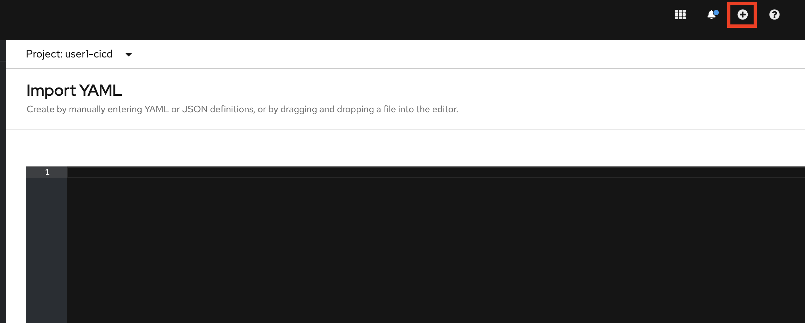
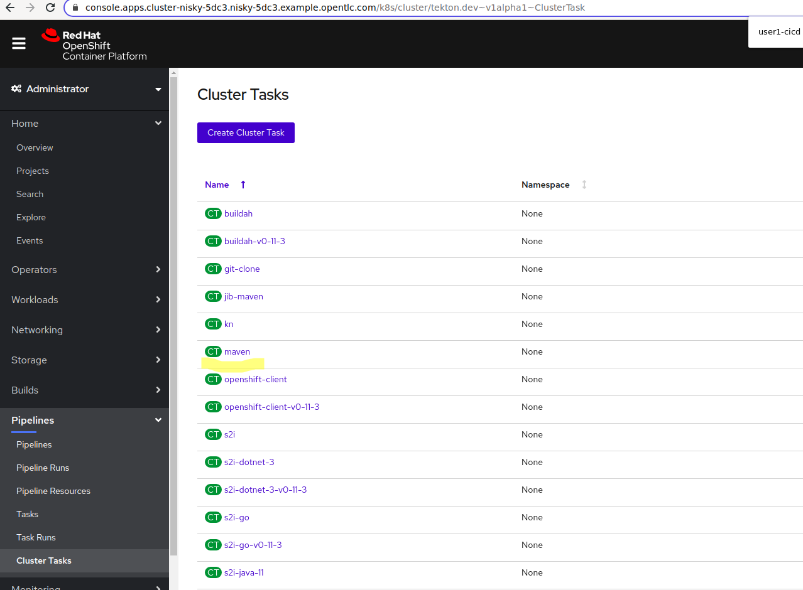
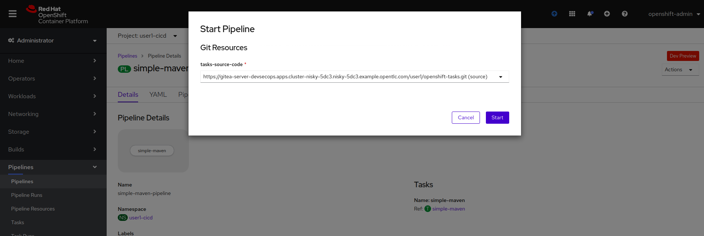
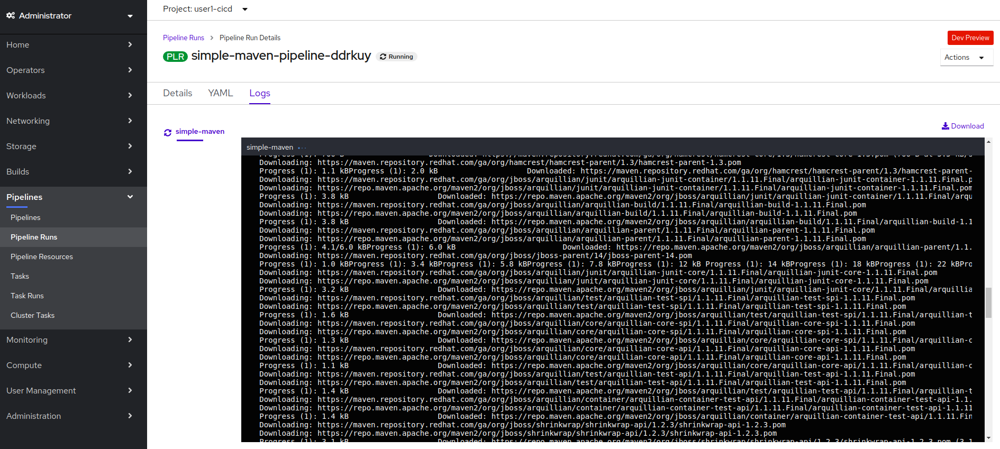

In this lab we will take our first steps in starting our DevSecOps pipeline. In doing so, we will not only end up with a working pipeline that performs a basic action on our project, but we will also discover a few ways to experiment with, work with, and learn about Tekton

# First Steps - Create a Resource for the Project

The project that we're working with is stored in a Git repository. The way Tekton uses Git repositories is by using a Git pipeline resource pointing to our source code repository.

Before we start working with Tekton, let's switch the default project to the `%username%-cicd` project:
```execute
oc project %username%-cicd
```

Let's figure out how to create a new Git pipeline resource:

```execute
tkn --help

```

The `tkn` cli tells us what resources we can interact with. We know that we want to create a Pipeline Resource, so let's see how it can help us with that.

```execute
tkn resource --help

```

Before we create the new Pipeline Resource, let's get the URL of the gitea server instance - note the URL of the server, which we will use in a bit to create a PipelineResource with:

```execute
oc get route -n devsecops gitea-server

```

So, the command we need is `create`. Then, let's create a new resource:

```execute
tkn resource create

```

Enter information like the following:

```shell
? Enter a name for a pipeline resource : tasks-source-code
? Select a resource type to create :  [Use arrows to move, type to filter]
  cloudEvent
  cluster
> git
  image
  pullRequest
  storage
? Select a resource type to create : git
? Enter a value for url :  https://gitea-server-devsecops.%cluster_subdomain%/%username%/openshift-tasks.git
? Enter a value for revision :  dso4

```

So, now we have created a resource manually using the `tkn` CLI. We could have similarly created the Pipeline Resource using YAML, and provided it to the `oc` cli as native Kubernetes YAML. The YAML snippet below could be used to create the same `PipelineResource`. In fact, **go ahead and run this anyway**, to be sure you entered the correct options:

```execute
oc -n user1-cicd apply -f - << EOF
apiVersion: tekton.dev/v1alpha1
kind: PipelineResource
metadata:
  name: tasks-source-code
spec:
  params:
    - name: url
      value: >-
        https://gitea-server-devsecops.%cluster_subdomain%/%username%/openshift-tasks.git
    - name: revision
      value: dso4
  type: git
EOF
```

> **Note:** To ensure a fluid workshop experience, Kubernetes resources are created using the CLI, as we've done above. If you prefer to use the Web Console, you can use the [Import YAML](%console_url%/k8s/ns/%username%-cicd/import) view, found by clicking the **+** button at the top right of your **Console** tab. You can then paste the content found between `EOF` tags in the labguide's code block.
> 

The additional options for specifying the Git Pipeline Resource are on the [Tekton github page](https://github.com/tektoncd/pipeline/blob/master/docs/resources.md#git-resource)

## Explore Tasks Catalog

The Tasks application is built using Maven, so we will need to find a container that has maven inside so that we can use it to build our application.

The first place we can look is the Cluster Task catalog that exists in OpenShift.



Let's see what this ClusterTask is all about.

```execute
tkn clustertask describe maven
```

The output of the task description looks similar to the one below: 
```bash
Name:   maven

📨 Input Resources

 No input resources

📡 Output Resources

 No output resources

⚓ Params

 NAME                      TYPE     DESCRIPTION              DEFAULT VALUE
 ∙ GOALS                   array    maven goals to run       [package]
 ∙ MAVEN_MIRROR_URL        string   The Maven repositor...
 ∙ PROXY_USER              string   The username for th...
 ∙ PROXY_PASSWORD          string   The password for th...
 ∙ PROXY_PORT              string   Port number for the...
 ∙ PROXY_HOST              string   Proxy server Host
 ∙ PROXY_NON_PROXY_HOSTS   string   Non proxy server ho...
 ∙ PROXY_PROTOCOL          string   Protocol for the pr...   http

🦶 Steps

 ∙ mvn-settings
 ∙ mvn-goals

```

Based on the output from the command above, we could run the cluster task with the following TaskRun. Unfortunately, at this time, creating a Task Run from the UI is not supported, so we'll build our own YAML (while inspecting the details of the [Task Runs docs in Tekton](https://github.com/tektoncd/pipeline/blob/master/docs/taskruns.md)). Create the TaskRun using the YAML below in your `%username%-cicd` project:

```execute
oc -n %username%-cicd create -f - << EOF
apiVersion: tekton.dev/v1beta1
kind: TaskRun
metadata:
  generateName: maven-example-
spec:
  taskRef:
    kind: ClusterTask
    name: maven
EOF
```

However, doing that fails - what's happening here? Let's inspect the TaskRun that we just created (run the command and choose the latest `maven-example-` `TaskRun`)

```execute
tkn tr logs -f
```

The results look similar to the output below
```bash
task maven has failed: bound workspaces did not match declared workspaces: didn't provide required values: [source maven-settings]
Error: pod for taskrun maven-example-k9bhw not available yet

```

Well, well - the error message complains about workspaces not being provided. If we re-looked at the `ClusterTask` we would see that it specifies two workspaces that need to be provided to use this cluster task:

* source
* maven-settings

Let's give it some empty workspaces and see if we can make it run. Create the `TaskRun` by running the command below:

```execute
oc -n %username%-cicd create -f - << EOF
apiVersion: tekton.dev/v1beta1
kind: TaskRun
metadata:
  generateName: maven-example-
spec:
  taskRef:
    kind: ClusterTask
    name: maven
  params:
    - name: GOALS
      value:
      - clean
      - package
  workspaces:
    - name: maven-settings
      emptyDir: {}
    - name: source
      emptyDir: {}
EOF
```

If we create this TaskRun and show the logs from running it, we will see an error message that there is no POM file in /workspace/source. Duh! Of course - we gave this task an empty directory as the "source" workspace, of course it will not be able to build our source - there is nothing there!!!

Run the command below, noting that we now use the `--last` option to automatically select the most recently executed `TaskRun`:

```execute
tkn tr logs -f --last
```
The output looks similar to the listing below:

```bash
... snipped for brevity ...
[mvn-goals] [INFO] Scanning for projects...
[mvn-goals] [INFO] ------------------------------------------------------------------------
[mvn-goals] [INFO] BUILD FAILURE
[mvn-goals] [INFO] ------------------------------------------------------------------------
... snipped for brevity ...
------------------------------------------------------------------------
[mvn-goals] [ERROR] The goal you specified requires a project to execute but there is no POM in this directory (/workspace/source). Please verify you invoked Maven from the correct directory. -> [Help 1]
... snipped for brevity ...
container step-mvn-goals has failed  : [{"key":"StartedAt","value":"2020-07-20T22:08:06Z","resourceRef":{}}]
```

So, while the ClusterTask seemed like a decent first pass at how to build our app, it appears this might require a bit more knowledge to use this ClusterTask (e.g. we will need to have a prior task that puts the Git repo into the `source` workspace). Let's put this on ice for a bit and explore some more.

# Local Containers: Experimentation and Feedback loops

OK, now we're back to the drawing board - we couldn't use the `ClusterTask` out of the box with our existing knowledge, but let's see what we can learn from it.

First off, let's talk about the importance of feedback loops. As engineers, we always want to have a short and tight feedback loop. The tighter the feedback loop, the faster we could experiment, and then the faster we could learn. From experience, the tightest feedback loop happens when engineers can play with things locally on their workstations. How could we do that with Tekton? Luckily, since Tekton is based entirely on running containers, we have a way!

Reviewing the content of the `maven` `ClusterTask`, we can see exactly what container image the `ClusterTask` uses to execute our maven goals:

```execute
tkn ct describe maven -o jsonpath="{.spec.steps[?(@.name=='mvn-goals')].image}" && echo

```

If we're curious, we pull down that image and explore it by using it just like any other container. In OpenShift, we can run an individual container within a `Pod` using `oc run`. This is useful for situations like ours, when we need an ephemeral test environment. Execute the command below:

```execute
oc run mvn-builder --image=gcr.io/cloud-builders/mvn --rm -it --command -- /bin/bash

```

Taking a moment to unpack the arguments we provided:
* `oc run mvn-builder` tells OpenShift to create a new `Pod` named `mvn-builder`
* `--image`, naturally, specifies what image we want to use for this `Pod`'s container. We're replicating the pipeline context here, so let's use the same image as the `ClusterTask`
* `--rm` indicates that this `Pod` should be *removed* when we're done  with it
* `-it` tells `oc` to give us an *interactive tty/shell*, since we want run a few commands in the container
* `--command` allows us to override what will be executed when the container starts. So rather than executing an **entrypoint script**, we'll just fire up a `bash` shell.

Having just run the command above, your upper **Terminal** is now in a shell within the running container. Let's see what Java and Maven versions are in there:
```execute
mvn -version
```

*Output (example)*
```bash
Apache Maven 3.6.3 (cecedd343002696d0abb50b32b541b8a6ba2883f)
Maven home: /usr/share/maven
Java version: 14.0.1, vendor: Oracle Corporation, runtime: /usr/java/openjdk-14
Default locale: en_US, platform encoding: UTF-8
OS name: "linux", version: "5.6.19-300.fc32.x86_64", arch: "amd64", family: "unix"
```

OK, this container uses Java 14, but our tasks app was built with Java 8. Could this be the problem? Let's pull down our `tasks` git repo and see if we can build it with this Maven container. We're going to work out of `/tmp` to ensure our user has the necessary filesystem permissions:

```execute
curl https://gitea-server-devsecops.%cluster_subdomain%/%username%/openshift-tasks/archive/dso4.tar.gz | tar xz -C /tmp

```

Let's verify the code pulled down and expanded as expected:

```execute
ls /tmp/openshift-tasks

```

*Output (example)*
```bash
README.md  app-template.yaml  configuration  pipeline-bc.yaml  pom.xml  src

```

**Excellent.** Now, let's attempt to run the goals we used in our pipeline:

```execute
mvn clean package -Dmaven.repo.local=/tmp/.m2 -f /tmp/openshift-tasks/pom.xml

```

Woo-hoo!!! We verified that the app source code is in our test container, and we can run the build. The build runs for a while and.... Womp, womp ! It fails with a Java compile error!!!

```shell
[ERROR] /tmp/openshift-tasks/src/main/java/org/jboss/as/quickstarts/tasksrs/model/Task.java:[137,16] cannot find symbol
  symbol:   variable JAXB
  location: class org.jboss.as.quickstarts.tasksrs.model.Task
[INFO] 18 errors
[INFO] -------------------------------------------------------------
[INFO] ------------------------------------------------------------------------
[INFO] BUILD FAILURE
[INFO] ------------------------------------------------------------------------
[INFO] Total time:  01:55 min
[INFO] Finished at: 2020-07-20T23:15:57Z
[INFO] ------------------------------------------------------------------------
[ERROR] Failed to execute goal org.apache.maven.plugins:maven-compiler-plugin:3.8.0:compile (default-compile) on project jboss-tasks-rs: Compilation failure: Compilation failure:
[ERROR] /tmp/openshift-tasks/src/main/java/org/jboss/as/quickstarts/tasksrs/model/User.java:[31,33] package javax.xml.bind.annotation does not exist

```

It looks like we can't use Java 14 to  build our app after all! Let's go and see if `gcr.io/cloud-builders/mvn` offers alternative version tags in [Google's Container Registry](https://console.cloud.google.com/gcr/images/cloud-builders/GLOBAL/mvn?gcrImageListsize=30):


Well, well - it looks like there is a Java 8 image there after all. Let's give that another try with a local container, we just have to use the `3.5.0-jdk-8` label and see that we can build our project.

First, exit our initial test container, if you haven't already:

```execute
exit

```
> **NOTE**
> If you accidentally exit your **Terminal**, you can restore it using *Reload Terminal* in the top-right dashboard menu.


Then let's start a new container, this time with the needed Maven version:
```execute
oc run mvn-builder --image=gcr.io/cloud-builders/mvn:3.5.0-jdk-8 --rm -it --command -- /bin/bash

```

Let's run the build again and see what happens
```execute
curl https://gitea-server-devsecops.%cluster_subdomain%/%username%/openshift-tasks/archive/dso4.tar.gz | tar xz -C /tmp
mvn clean package -Dmaven.repo.local=/tmp/.m2 -f /tmp/openshift-tasks/pom.xml

```

The output from the command should be similar to the content below:
```bash
[INFO] Scanning for projects...
Downloading: https://maven.repository.redhat.com/ga/org/jboss/bom/jboss-eap-javaee7/7.0.1.GA/jboss-eap-javaee7-7.0.1.GA.pom
... snipped for brevity ...
[INFO] Building war: /tmp/openshift-tasks/target/openshift-tasks.war
[INFO] WEB-INF/web.xml already added, skipping
[INFO] ------------------------------------------------------------------------
[INFO] BUILD SUCCESS------------------------------------------------------------------------
------------------------------------------------------------------------

```

W00t, w00t!! The build runs for a little while and successfully completes - now we are getting somewhere!!!

The big takeaways from the work so far:

* Since Tekton runs all of the tasks in pods, we can very easily experiment with the same containers until we see something work.
* With a little bit of knowledge about how Tekton works, replicate the container context to make it as similar as possible for when we move our work into Tekton proper.

If you haven't already, go ahead and exit your container, and we'll continue onward.

```execute
exit

```

# Create a Standalone TaskRun

Now that we know how to use the Maven container (with the right Java version) to build our project, we can go back and have Tekton run it for us. As a first step, we will create a new TaskRun which uses an `inline` Task spec - just so that we don't have to create a separate Task object while we're still experimenting

```execute
oc -n %username%-cicd create -f - << EOF
apiVersion: tekton.dev/v1beta1
kind: TaskRun
metadata:
  generateName: maven-java8-inline-example-
spec:
  resources:
    inputs:
      - name: source
        resourceRef:
          name: tasks-source-code
  taskSpec:
    resources:
      inputs:
        - name: source
          type: git
    steps:
    - name: mvn-goals
      args:
        - clean
        - package
        - -f
        - \$(inputs.resources.source.path)/pom.xml
      command:
        - /usr/bin/mvn
      image: gcr.io/cloud-builders/mvn:3.5.0-jdk-8
EOF
```

A couple of things to note in the TaskRun example above:

* Since the `spec.taskSpec.resources.inputs` specifies that the Task requires a Git input resource, the TaskRun has to provide it in the `spec.resources.inputs` field.
* In the example above we used Tekton's parameter substitution - e.g. a PipelineResource named `foo` will be mounted in /workspace/foo, and can be referenced using the `$(inputs.resources.foo.path)` parameter substitution. Note that we're also using the `.path` suffix after the name of the resource to get its absolute path (a little bit more Tekton resource magic from the [Tekton Git repo](https://github.com/tektoncd/pipeline/blob/master/docs/resources.md#variable-substitution)


With this, we can observe Tekton successfully run our Maven commands:

```execute
tkn tr logs -f --last
```
The output of the command is similar to the output below:
```bash
... snipped for brevity ...
[mvn-goals] [INFO] Packaging webapp
[mvn-goals] [INFO] Assembling webapp [jboss-tasks-rs] in [/workspace/source/target/openshift-tasks]
[mvn-goals] [INFO] Processing war project
[mvn-goals] [INFO] Copying webapp resources [/workspace/source/src/main/webapp]
[mvn-goals] [INFO] Webapp assembled in [51 msecs]
[mvn-goals] [INFO] Building war: /workspace/source/target/openshift-tasks.war
[mvn-goals] [INFO] WEB-INF/web.xml already added, skipping
[mvn-goals] [INFO] ------------------------------------------------------------------------
[mvn-goals] [INFO] BUILD SUCCESS
[mvn-goals] [INFO] ------------------------------------------------------------------------
[mvn-goals] [INFO] Total time: 46.141 s
[mvn-goals] [INFO] Finished at: 2020-07-20T23:36:45Z
[mvn-goals] [INFO] Final Memory: 32M/969M
[mvn-goals] [INFO] ------------------------------------------------------------------------
```

So now, the last step is to take our TaskSpec and move it into a standalone task. We'll convert from `arg/command` format to `script` format here to ensure that code coverage reports are generated correctly later:

```execute
oc -n %username%-cicd create -f - << EOF
apiVersion: tekton.dev/v1alpha1
kind: Task
metadata:
  name: simple-maven
spec:
  resources:
      inputs:
        - name: source
          type: git
  steps:
    - name: mvn-goals
      script: |
        /usr/bin/mvn clean package -f \$(inputs.resources.source.path)/pom.xml
      image: gcr.io/cloud-builders/mvn:3.5.0-jdk-8
EOF
```

Now that we have a task, we can really simplify the TaskRun:

```execute
oc -n %username%-cicd create -f - << EOF
apiVersion: tekton.dev/v1beta1
kind: TaskRun
metadata:
  generateName: simple-maven-
spec:
  resources:
    inputs:
      - name: source
        resourceRef:
          name: tasks-source-code
  taskRef:
    name: simple-maven
EOF
```

We can also see the `TaskRun` succeed:
```execute
tkn tr logs -f --last
```

The output from the Task Run is similar to the content below:
```bash
#... snipped for brevity ...
[mvn-goals] Downloading: https://repo.maven.apache.org/maven2/com/thoughtworks/xstream/xstream/1.3.1/xstream-1.3.1.jar
Downloaded: https://repo.maven.apache.org/maven2/org/codehaus/plexus/plexus-io/1.0.1/plexus-io-1.0.1.jar (51 kB at 2.1 MB/s)
Downloaded: https://repo.maven.apache.org/maven2/org/codehaus/plexus/plexus-archiver/1.2/plexus-archiver-1.2.jar (182 kB at 6.1 MB/s)
Downloaded: https://repo.maven.apache.org/maven2/com/thoughtworks/xstream/xstream/1.3.1/xstream-1.3.1.jar (431 kB at 11 MB/s)
[mvn-goals] [INFO] Packaging webapp
[mvn-goals] [INFO] Assembling webapp [jboss-tasks-rs] in [/workspace/source/target/openshift-tasks]
[mvn-goals] [INFO] Processing war project
[mvn-goals] [INFO] Copying webapp resources [/workspace/source/src/main/webapp]
[mvn-goals] [INFO] Webapp assembled in [54 msecs]
[mvn-goals] [INFO] Building war: /workspace/source/target/openshift-tasks.war
[mvn-goals] [INFO] WEB-INF/web.xml already added, skipping
[mvn-goals] [INFO] ------------------------------------------------------------------------
[mvn-goals] [INFO] BUILD SUCCESS
[mvn-goals] [INFO] ------------------------------------------------------------------------

```

# Add the Task into a one-step pipeline

Now that we can execute the task from the TaskRun, we can proceed and create our first pipeline. This pipeline will:

* Declare a single Git pipeline resource that needs to be provided to it
* It will use this resource to invoke the simple-maven task

If we want to use the Web Console, click [this link](%console_url%/k8s/ns/%username%-cicd/tekton.dev~v1beta1~Pipeline/~new/builder) to bring you to the Pipeline Creation wizard, and specify the inputs shown below:


**OR** using the CLI:

```execute
oc -n %username%-cicd apply -f - << EOF
apiVersion: tekton.dev/v1alpha1
kind: Pipeline
metadata:
  name: tasks-dev-pipeline
spec:
  resources:
    - name: tasks-source-code
      type: git
  tasks:
    - name: simple-maven
      resources:
        inputs:
          - name: source
            resource: tasks-source-code
      taskRef:
        kind: Task
        name: simple-maven
EOF
```

Now, starting this pipeline is pretty straightforward, even using the GUI - the Console will launch a prompt to specify which PipelineResource needed to invoke the pipeline with:



We can now observe the execution of the Pipeline Run in the Console and follow the logs:


# Conclusion

In this lab we learned how to explore what Tekton provides, and we have some easy building blocks that we can use going forward, regardless of what steps we need to build the pipeline with. In summary, the steps are as follows:

1. Find a container that has the tool that we need - be it maven, s2i, or just plain bash.
1. Launch the container with the tool locally to figure out the details on how to interact with the tool. Here, we might need to play with some podman/docker options with mounting directories, etc. The more you can replicate some of the conventions of the Tekton environment (e.g. where resources are mounted, where workspaces end up, etc), the easier it will be to later transition to Tekton.
1. Once we have the arguments that we need to invoke the container with, we can now experiment with a TaskRun with an inline Task - this way we can see Tekton execute the tool and we can adjust the tool parameters and perform the relevant parameter substitutions, paths, etc.
1. Once we have a working Task, move it to a standalone Task. Confirm that the standalone Task works with a TaskRun (with all the right parameters)
1. Once we have a working standalone Task, integrate it into a Pipeline
1. Run the Pipeline

The next lab will explore further how to make a Task a reusable component.
