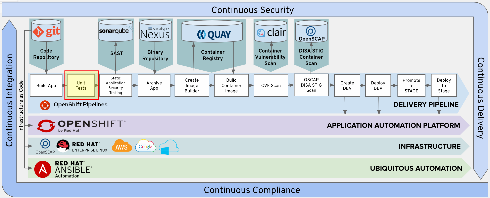

# Introduction  

In this lab, we will add the **Unit Test** stage of the DevSecOps pipeline



# Add New Task to the Pipeline 

Since the tests in a maven project are run directly by Maven, all we need is to add a new task to our pipeline that will call the `test` goal. We can reuse our existing `simple-maven` task and pass a parameter for the `GOAL` param in the task.

The only thing that is different about the `test-app` task in the pipeline is that we are using the `runAfter` attribute so that the `test-app` task runs in *after* `build-app` instead of in parallel (this will come in handy very shortly). Since we need to add an additional  step to the pipeline, we're going to **patch** our `Pipeline` object. We've already wired up a command string for you so you don't have to worry about managing indentation:

```execute
TASKS="$(oc get pipelines tasks-dev-pipeline -o yaml | yq r - 'spec.tasks' | yq p - 'spec.tasks')" && oc patch pipelines tasks-dev-pipeline --type=merge -p "$(cat << EOF
$TASKS
    - name: test-app
      taskRef:
        kind: Task
        name: simple-maven
      params:
          - name: GOALS
            value: test 
          - name: SETTINGS_PATH
            value: configuration/cicd-settings-nexus3.xml
          - name: POM_PATH
            value: pom.xml
      resources:
        inputs:
          - name: source
            resource: pipeline-source
      workspaces:
        - name: maven-repo
          workspace: local-maven-repo
      runAfter:
          - build-app
EOF
)"
```

# Run the Pipeline
OK - so, the pipeline is a little verbose, but beyond a few of the repeated configuration parameters (e.g. like SETTINGS_PATH, resources, etc), we're just leaning the hard work that we did in the previous lab. 

This time, since we're not passing any new parameters to the pipeline, we can just rerun the previous pipeline run. Click [here](%console_url%/k8s/ns/%username%-cicd/tekton.dev~v1beta1~PipelineRun) to jump to the Pipeline Runs screen, then Rerun the top entry in the list.


In the Pipeline Run details screen, we can now see the two tasks in the pipeline executing one after another. 


# Conclusion

In this stage we just ended up reusing our work in building a reusable task and we were able to very quickly add a new Task in the pipeline.