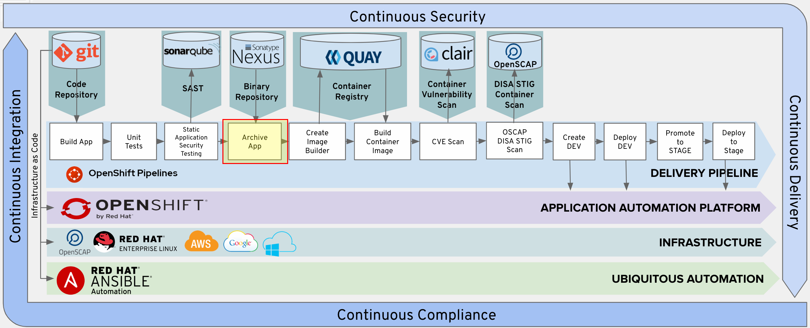
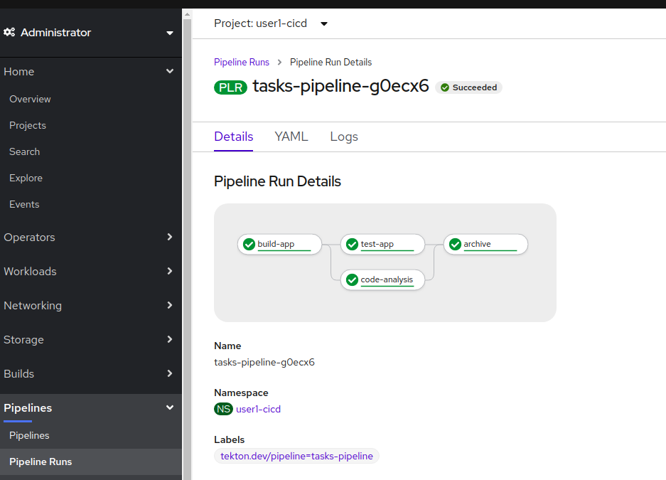

# Introduction

This lab will add the **Archive** stage to the pipeline



# Add Archive Stage

Archiving the built and tested application into a trusted repository is important to making sure we are building with trusted parts.  We assume this application is built properly and all the previous stages have passed.  With that confidence, our built and tested application should be immutable in a trusted repository.  The repository will version or audit any changes to the application, configuration, and dependencies.

We leveraged the maven nexus plugin for this deployment.  The `mvn deploy` step is the last step in the maven lifecycle.  The built application is archived into the nexus repository.  We can see it later once we run the pipeline.

The `-P nexus3` option activates the nexus3 profile defined in `configuration/cicd-settings-nexus3.xml`:

# Update pipeline

```execute
TASKS="$(oc get pipelines tasks-dev-pipeline -o yaml | yq r - 'spec.tasks' | yq p - 'spec.tasks')" && oc patch pipelines tasks-dev-pipeline --type=merge -p "$(cat << EOF
$TASKS
    - name: archive
      taskRef:
        kind: Task
        name: simple-maven
      params:
          - name: GOALS
            value: 'deploy -DskipTests=true -Pnexus3' 
          - name: SETTINGS_PATH
            value: configuration/cicd-settings-nexus3.xml
          - name: POM_PATH
            value: pom.xml
      resources:
        inputs:
          - name: source
            resource: pipeline-source
      workspaces:
        - name: maven-repo
          workspace: local-maven-repo
      runAfter:
          - test-app
          - code-analysis
EOF
)"
```

One thing to call out here is that the `runAfter` attribute of the task allows us to wait for both of the tasks to complete (and be successful), before this task can run.

# Test Your Pipeline

Either run the pipeline from the command line, or re-run the previous PipelineRun from the Console:
```execute
tkn pipeline start --resource pipeline-source=tasks-source-code --workspace name=local-maven-repo,claimName=maven-repo-pvc tasks-dev-pipeline --showlog
```



Now we can view the artifact we just published in this workshop's [Nexus Repository](http://nexus-devsecops.%cluster_subdomain%). 

Navigate to **Browse** from the left-hand navigation menu, and click into the `maven-snapshots` repository. Below is the SNAPSHOT artifacts that have been created so far: 


# Conclusion

We have continued extending the pipeline using the `simple-maven` task, and we now have the artifact from the application build securely stored in the Nexus repository after it passes all the tests. This step in the pipeline also illustrates how to use more advanced flows where the flow of execution converges after executing more than one parallel task. 
