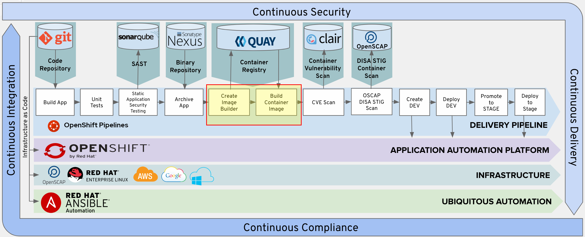
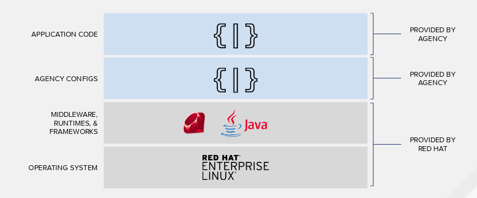
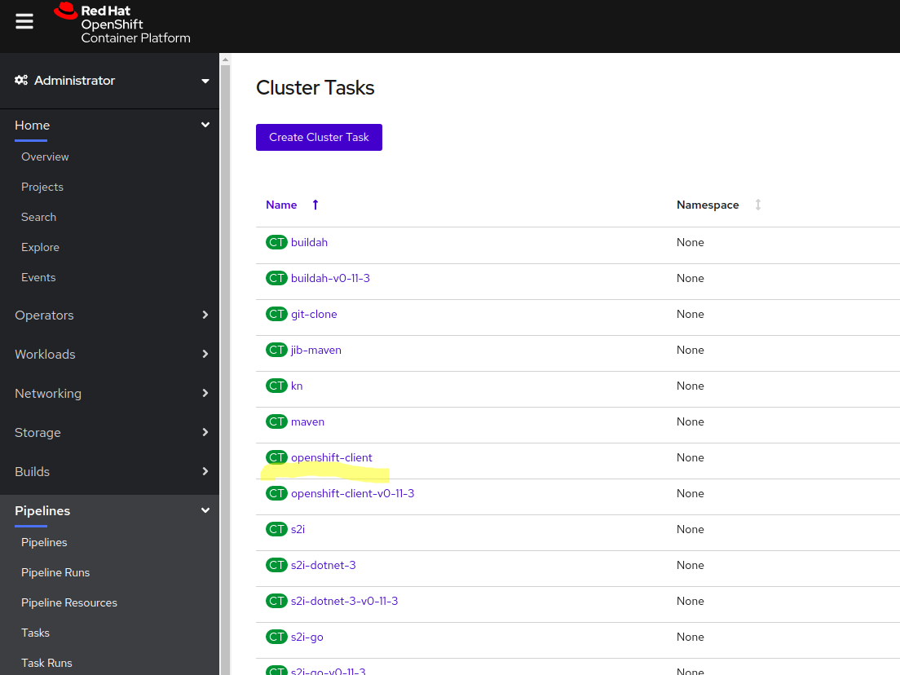
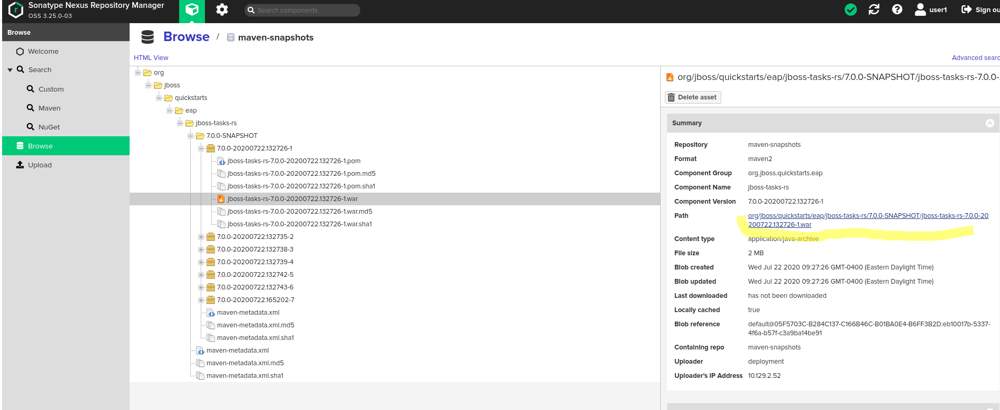
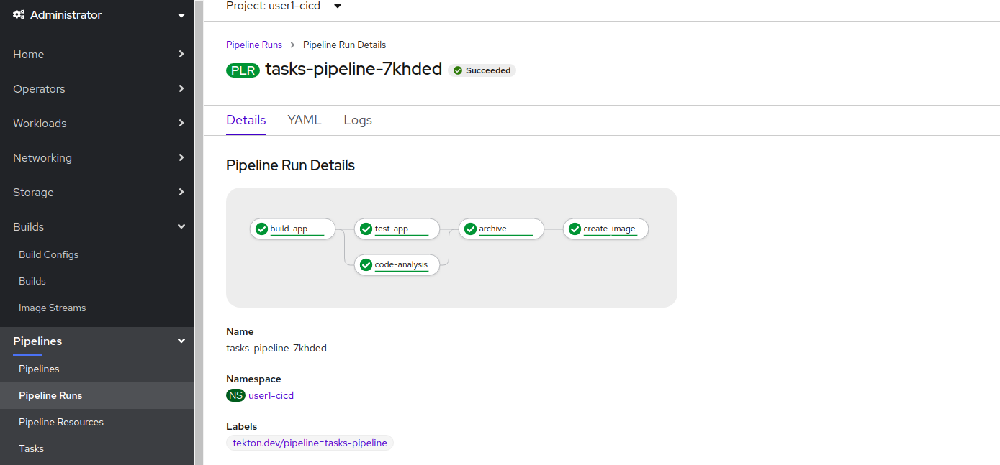

# Introduction

In this lab we will add the "Image Builder" and "Build Container Image"  stages in our pipeline



# OpenShift, Containers, and Container Images

Containers are an important foundation for applications in building a Trusted Software Supply Chain.  We want a secure and blessed golden container image that our application will inherit security controls from.

Containers are built using a layered approach. For example, to create a container of a Java web application, you could do so in multiple layers: the OS, the JVM, the web server, and the code itself.



We can incorporate CVE and vulnerability scanning against images in an automated fashion.  Any image change is scanned to improve the inherited security of our application.  We have partners such as Black Duck and Twistlock that do container image scanning.  Also, as a result of Red Hat's acquisition of CoreOS, we now offer Quay as an enterprise-grade registry that does vulnerability scanning.

We can also cryptographically sign the resulting image so we know the container is running with a verified container image.

## Start with Quality Parts

Red Hat has a container registry that provides certified Red Hat and third-party container images that will be the foundation of our container images.  Our registry also has a health index of the image so we know the state of the image.


## OpenShift Container Images and Tools 
In the last few stages, because goal could be accomplished by invoking a Maven goal, we were able to use the `simple-maven` task that we built in the earlier steps. At this point, however, we will need to work a lot more closely with OpenShift as a platform. Although there are some Maven plugins that allow Maven to interact with OpenShift, this is a place where it makes sense to use OpenShift's own capabilities through the `oc` CLI. 

As we discussed before, we want to have a feedback loop that is as tight as possible so that we can experiment with and learn as quickly as possible. 

There are a few different ways we can go about in creating a container image for the application. One way would be to build our own from scratch using a Dockerfile, e.g.
* Start from a secure base image
* Add the JVM and JBoss EAP runtime binaries
* Add the Tasks apps binaries where the EAP runtime expects them to be
* Build the container image on the local machine and push it to a container registry that is accessible to OpenShift

Because this is such a common need for container applications, OpenShift provides a set of building blocks that make the process much easier. The OpenShift builds system is beyond the scope of what we can cover in a workshop, but in short here are the essentials. 

An OpenShift binary BuildConfig encapsulates all four steps above:
* We can specify the `builder-image` that would perform the steps above- in this case, it is `jboss-eap72-openshift:1.1` which is available in OpenShift's internal registry. Similar Builder images exist for other common software components - e.g. be it a nodejs application, a plan java app (with a runnable jar), or a python app built using django
* Once this binary build is created, we can stream the contents of the WAR we want to deploy into it
* The BuildConfig will use the builder image to produce a new image that contains the runtime of a hardened, secured, and up-to-date image of the JBoss EAP runtime with the Tasks WAR deployed in it
* The BuildConfig will push the newly created image into the internal repository which we can then use to deploy 

## openshift-client ClusterTask
Similarly to our experimentation stage in [Lab 06](lab06.md), we first need to find a pre-existing Task (such as a ClusterTask), or a container image that has the `oc` CLI. 

Looking at the Task Catalog, we can see that there is an existing `openshift-client` ClusterTask



Let's investigate that ClusterTask, it might just do the job.
```execute
tkn  clustertask describe openshift-client
```

The details of the ClusterTask looks something similar to the output below:
```
Name:   openshift-client

📨 Input Resources

 NAME       TYPE
 ∙ source   git

📡 Output Resources

 No output resources

⚓ Params

 NAME       TYPE     DESCRIPTION              DEFAULT VALUE
 ∙ SCRIPT   string   The OpenShift CLI a...   oc $@
 ∙ ARGS     array    The OpenShift CLI a...   [help]

🦶 Steps

 ∙ oc

```
This ClusterTask comes in very handy if we need to implement a stage that just needs to send a command or two to OpenShift using the `oc` CLI. Alternatively, we could use the same container image as the ClusterTask if we need more complicated structure or behavior for the stage.  

# Implement "Create Image" stage in pipeline 

## Experiment and validate 
Let's go through those steps to work through the mechanics of how this works:
1. Download the Tasks WAR file from Nexus:
Navigate to Nexus, login with your credentials, and browse the `maven-snapshots` repository, navigate into the org/jboss/quickstarts/jboss-tasks-rs/7.0.0-SNAPSHOT artifact and copy the link URL from the  "Path" link (from the right panel) 



2. For simplicity purposes, create a separate directory (e.g. `oc-build`), and copy the downloaded war file into that folder


```execute
mkdir ./oc-build
```
Now, download the war file into the oc-build directory (be sure to replace ). The link would look something like this : `http://nexus-devsecops.%cluster_subdomain%/repository/maven-snapshots/org/jboss/quickstarts/eap/jboss-tasks-rs/7.0.0-SNAPSHOT/jboss-tasks-rs-7.0.0-20200810.140415-1.war' . Run the command below, replacing the <jboss-tasks-war-url#> token with the URL you copied.

```bash
wget  -O oc-build/jboss-tasks-rs-7.0.0-SNAPSHOT.war <jboss-tasks-war-url#>
```

1. Create a new binary build in your OpenShift user's Dev project :
```execute
oc new-build --name=tekton-tasks --image-stream jboss-eap72-openshift:1.1  --binary=true -n %username%-dev
```
The output of the new build looks similar to the content below: 
```bash
--> Found image 0ca7413 (10 months old) in image stream "openshift/jboss-eap72-openshift" under tag "1.1" for "jboss-eap72-openshift:1.1"

    JBoss EAP 7.2 
    ------------- 
    Platform for building and running JavaEE applications on JBoss EAP 7.2

    Tags: builder, javaee, eap, eap7

    * A source build using binary input will be created
      * The resulting image will be pushed to image stream tag "tekton-tasks:latest"
      * A binary build was created, use "oc start-build --from-dir" to trigger a new build

--> Creating resources with label build=tekton-tasks ...
    imagestream.image.openshift.io "tekton-tasks" created
    buildconfig.build.openshift.io "tekton-tasks" created
--> Success
```

4. Start the OpenShift build and wait for it to complete

```execute
oc start-build tekton-tasks --from-dir=./oc-build/ -n %username%-dev --wait=true
```

With these three steps, we can see the following in the OpenShift Console:
* A new `tekton-tasks` Build Config 

* A new `tekton-tasks-*` build run and complete successfully

* A new `tekton-tasks` image stream (which is an OpenShift construct similar to a container image but with a few more capabilities), together with the location in the image registry where that image can be pulled from 


## Create a Task to create the container image

Now that we know the exact commands that we need in our Pipeline, let's add an extra task to make that happen. Because we want to be able to experiment with this Task until we get it right, we will put the commands in a separate Task and run it until we get it right ( and we will parametrize the task out of the box so that we can easily work with it from the pipeline). 

A few things to note:
* The task uses the `quay.io/openshift/origin-cli:latest` container image to execute the commands. If we only had to run a command-or-two for this stage, we could have used the existing ClusterTask, but because we also have to do some checking and clean-up (to make the task run repeatable), we will just lean on the same container image that the ClusterTask uses
* The `set -e -o pipefail` makes the step fail if any of the commands fail in running (so that we don't have to check exit codes for each command)
* Since we have access to the local Maven repo in the `maven-repo` workspace, we will use the artifact that the prior steps in the pipeline put there. In a production setup, this artifact would likely be retrieved from the Nexus artifact repository 
* Using our own Task for this stage will also allow us to extend the task as we need to if there are future changes that are required without changing the actual pipeline
  
```yaml
apiVersion: tekton.dev/v1beta1
kind: Task
metadata:
  name: create-image
spec:
  params:
    - default: tasks
      description: The name of the app
      name: app_name
      type: string
    - description: The name dev project
      name: dev_project
      type: string
    - description: binary artifact path in the local artifact repo
      # something like org/jboss/quickstarts/eap/jboss-tasks-rs/7.0.0-SNAPSHOT/jboss-tasks-rs-7.0.0-SNAPSHOT.war
      type: string
      name: artifact_path
  resources:
    inputs:
      - name: source
        type: git
  steps:
    - name: create-build-config
      image: 'quay.io/openshift/origin-cli:latest'
      script: >
        #!/bin/sh

        set -e -o pipefail

        echo "Creating new build config"  

        # This allows the new build to be created whether it exists or not

        oc new-build -o yaml --name=$(params.app_name) --image-stream=jboss-eap72-openshift:1.1  --binary=true -n
        $(params.dev_project) | oc apply -n $(params.dev_project) -f - 
    - name: build-app-image
      image: 'quay.io/openshift/origin-cli:latest'    
      script: >
        #!/bin/sh

        set -e -o pipefail

        echo "Start the openshift build"  


        rm -rf $(inputs.resources.source.path)/oc-build && mkdir -p $(inputs.resources.source.path)/oc-build/deployments 


        cp $(workspaces.maven-repo.path)/$(params.artifact_path) $(inputs.resources.source.path)/oc-build/deployments/ROOT.war 


        oc start-build $(params.app_name) --from-dir=$(inputs.resources.source.path)/oc-build -n   $(params.dev_project) --wait=true 


  workspaces:
    - name: maven-repo
```

Now, let's clean up the resources that we created manually and try running the task:
```execute
oc delete buildconfig tekton-tasks -n %username%-dev
oc delete imagestream tekton-tasks -n %username%-dev
```

Let's start the task and see it re-create the same resources:
```execute
tkn task start --inputresource source=tasks-source-code --param app_name=tekton-tasks  --param dev_project=%username%-dev --param artifact_path='org/jboss/quickstarts/eap/jboss-tasks-rs/7.0.0-SNAPSHOT/jboss-tasks-rs-7.0.0-SNAPSHOT.war' --workspace name=maven-repo,claimName=maven-repo-pvc create-image --showlog
```

We should observe the same BuildConfig and ImageStream artifacts being created in the %username%-dev project as when we created them manually. 

## Add the task to create container image to the pipeline

With all this done, we can update the pipeline to run after the archive task 
```yaml
apiVersion: tekton.dev/v1beta1
kind: Pipeline
metadata:
  name: tasks-dev-pipeline
spec:
  resources:
    - name: pipeline-source
      type: git

  workspaces:
    - name: local-maven-repo

  tasks:
    - name: build-app
      # ... snipped for brevity ... 
    - name: test-app
      # ... snipped for brevity .. 
    - name: code-analysis
      # ... snipped for brevity
    - name: archive
      # ... snipped for brevity
    - name: create-image
      taskRef:
        kind: Task
        name: create-image
      params:
          - name: app_name
            value: tekton-tasks
          - name: dev_project
            value: %username%-dev
          - name: artifact_path
            value: 'org/jboss/quickstarts/eap/jboss-tasks-rs/7.0.0-SNAPSHOT/jboss-tasks-rs-7.0.0-SNAPSHOT.war'
      resources:
        inputs:
          - name: source
            resource: pipeline-source
      workspaces:
        - name: maven-repo
          workspace: local-maven-repo
      runAfter:
          - archive

```

With that in place, re-start the last Pipeline run from the Web Console and observe the completion of the pipeline. The expected artifacts are again found in the %username%-dev project (BuildConfig, ImageStream, etc)
```execute
tkn pipeline start --resource pipeline-source=tasks-source-code --workspace name=local-maven-repo,claimName=maven-repo-pvc tasks-dev-pipeline --showlog
```



# Conclusion

In this lab we extended the pipeline by creating a container image from our Tasks application. The image we created is based on a secure base image, with a minimal set of bits of JBoss EAP included - only what's needed to run our application. 

