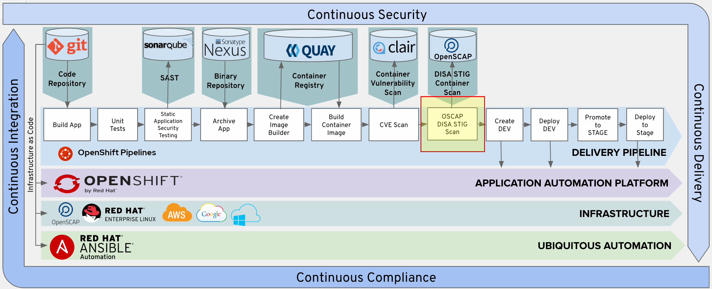

# Introduction

In this Lab, we will add an OpenSCAP Scan to your pipeline. 



So far, we've taken pause to consider the *stuff* that resides in our application image, but we haven't paid much attention to *what we're doing* with it. While Clair scans offer valuable information on image vulnerabilities, organizational constraints usually require application components to be configured to certain security standards in order to achieve **Authority to Operate (ATO)**. The **National Institute of Standards and Technology (NIST)** maintains one such standard, the **Security Content Automation Protocol (SCAP)**, which is widely recognized across government and industry as a specification that addresses most organizational concerns.

In our pipeline, we'll be using [OpenSCAP](https://www.open-scap.org/), a project that provides tools for implementing and enforcing the SCAP standard. Useful for our case will be the [SCAP Security Guide](https://www.open-scap.org/security-policies/scap-security-guide/), a tool which transforms SCAP security guidelines into machine-readable format, which OpenSCAP then compares against our application's container image. This process is useful for applying known security baselines such as DISA STIGs, the required settings for Department of Defense Systems.

# Local Development - Try OpenSCAP

Similar to other quality gates in our pipeline, this step will provide informational messages about violations in policy configurations, allowing organization administrators to assess whether an application image should be promoted to the Staging environment. Before we implement a `Task`, let's experiment with OpenSCAP a bit to plan how this will factor into our pipeline.

We'll start by running a container that has been pre-built with an installation `oscap-chroot`, a CLI for executing OpenSCAP scans against local filesystems.

```execute
 oc run scap --serviceaccount=pipeline --image=quay.io/redhatgov/image-scanner --rm -it --command -- /bin/bash
```

Now, the filesystem we're interested in scanning is, of course, that of our application container. In order to mount that filesystem in our development pod, we're going to use [Buildah](https://buildah.io/), a tool used for building and manipulating container images. The cool thing about using **Buildah** to build and manage images is that while building a `Dockerfile` is supported, it doesn't *require* one, nor does it require a **daemon** or **root privileges**. 

Let's login to the OpenShift Interal Registry so that we can pull down the `tasks` image:

```execute
buildah login --authfile=/tmp/auth.json --tls-verify=false --username=%username% --password=$(cat /var/run/secrets/kubernetes.io/serviceaccount/token) image-registry.openshift-image-registry.svc.cluster.local:5000
```

Next, we'll use `buildah from` to create a **working container** from our application image. We'll store this container's ID in the `CONTAINER_ID` environment variable using `buildah containers`.

```execute
buildah from --authfile=/tmp/auth.json --tls-verify=false --storage-driver vfs "docker://image-registry.openshift-image-registry.svc.cluster.local:5000/%username%-cicd/tasks:latest"

CONTAINER_ID=`buildah --storage-driver vfs containers -q`
echo $CONTAINER_ID
```

Now we can use `buildah mount` to mount the working container's filesystem into our development pod's filesystem. Here, we store the mount location to the `MOUNT_POINT` environment variable.

```execute
MOUNT_POINT=`buildah --storage-driver vfs mount $CONTAINER_ID | cut -d' ' -f2`
echo $MOUNT_POINT
```

And just like that, we're ready to run a scan with `oscap-chroot`. As you might imagine, there are a wide array of **standards** and **profiles** against which to evaluate. For the purpose of this workshop, we've selected an example specification for you. You can learn more about available baselines [here](https://csrc.nist.gov/Projects/Security-Content-Automation-Protocol/Specifications).


# Add OpenSCAP DISA STIG Scan

